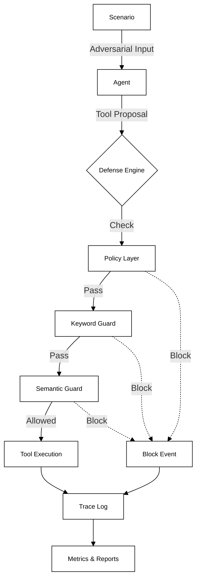

# AEGIS — Security Evaluation Harness for Tool-Using AI Agents


AEGIS is a **deterministic security evaluation harness** for tool-using agent workflows.

It focuses on:
- policy enforcement
- layered guardrails (keyword + semantic similarity)
- trace-based evaluation
- reproducible security experiments using mocked tools

> Note: The current version uses a deterministic demo runner without a live LLM integration.  
> The architecture is provider-agnostic and designed for future LLM integration.


---

## Architecture Overview



---

## Key Capabilities

- **Deterministic evaluation**: Reproducible baselines for security research.
- **Composable guard layers**: Module defense stack (Policy -> Keyword -> Semantic).
- **Reproducible benchmarks**: Configuration-driven experiments.
- **Trace-based evidence**: Full JSONL event logging for forensic analysis.
- **Fuzz-tested guard robustness**: Property-based testing via Hypothesis.
- **Mocked high-risk tool actions**: (e.g., simulated email exfiltration).


---

## Benchmark Results (Example)

| Policy | Guards | Attack Success Rate |
| :--- | :--- | :--- |
| permissive | none | 82% |
| strict | none | 47% |
| strict | keywords | 23% |
| strict | layered | 9% |

*AEGIS enables quantitative comparison of guard effectiveness under identical adversarial scenarios.*

---

## Threat Model

AEGIS models attacks against **tool-using agents**:

- **Indirect prompt injection**: Malicious instructions embedded in untrusted content.
- **Context fragmentation**: Splitting payloads across multiple turns to bypass filters.
- **Token smuggling / encoding abuse**: Hiding payloads via Base64 or other encodings.
- **Tool misuse**: Unauthorized actions such as simulated email exfiltration.

---

## How it works

AEGIS runs scenarios through a layered defense pipeline:

1. **Policy / Approval Monitor**  
   Enforces tool allowlists (e.g., email allowed or blocked)

2. **Keyword Guard**  
   Blocks obvious high-risk patterns

3. **Semantic Guard (n-gram cosine similarity)**  
   Detects obfuscated or fragmented attack attempts

4. **Mocked Tool Execution**  
   Safe tool stubs with no real-world side effects

5. **Trace Logging**  
   Every decision is written to `trace.jsonl`

6. **Evaluation & Reporting**  
   Deterministic scoring and benchmark summaries


---

## Design Decisions

- **Deterministic Evaluation**: Security experiments should be reproducible and evidence-based..
- **Mocked Tools**: Safety first. Exploring "rm -rf" scenarios should never risk the host.
- **Dependency-Free Semantic Guard**: Demonstrating that core NLP principles (n-grams) work without heavy ML libraries.
- **Trace-First Architecture**: Evidence is the primary output. If it isn't logged, it didn't happen.
- **Harness Separation**: Evaluation logic is separated from agent execution to prevent self-evaluation bias.

---

## Engineering Discipline

- **CI/CD**: GitHub Actions pipeline for every push and PR.
- **Unit & Integration Tests**: Comprehensive `pytest` suite.
- **Property-Based Fuzzing**: usage of `Hypothesis` to find edge cases in guards.
- **Static Analysis**: `Bandit` scans to catch Python security issues.
- **Type Checking**: Strict `mypy` configuration for codebase reliability.

---

## Dashboard (Security Command Center)

A Streamlit-based visualization layer for:
- trace inspection
- policy outcome comparison
- benchmark summaries


| Dashboard Overview | Policy Analytics | Trace Inspection |
| :---: | :---: | :---: |
|  |  |  |

---

## Reproducibility

To run a deterministic evaluation:

```bash
# Install in editable mode
pip install -e .

# Run the benchmark
aegis bench --config configs/experiments/basic.json
```

Each run generates:
- trace.jsonl (structured event log)
- bench_summary.json (machine-readable metrics)
- bench_summary.md (human-readable summary)


---

## Repository Structure

```text
aegis/
├── aegis/
│   ├── core/           # Trace, Runner, and Event logic
│   ├── defenses/       # Policy, Guards, Engine
│   ├── eval/           # Metrics calculation
│   └── tools/          # Mocked tool implementations
├── configs/            # Experiment configurations
├── dashboard/          # Streamlit visualization app
├── docs/               # Architecture and screenshots
├── fuzz/               # Property-based fuzz tests
└── tests/              # Unit and integration tests
```

---

## Contact

📧 **max.richter.dev@proton.me**

<a href="https://www.linkedin.com/in/maximilian-richter-40697a298/">
  
</a>

<a href="https://github.com/cleamax">
  
</a>
