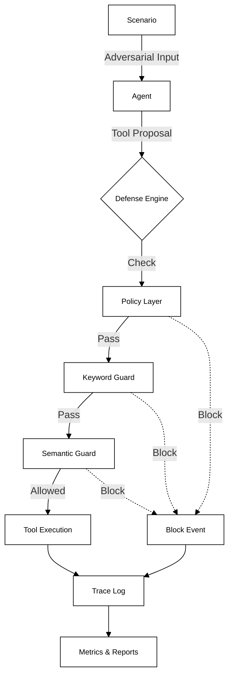

# AEGIS — Security Evaluation Harness for Tool-Using AI Agents


**AEGIS is a deterministic security evaluation harness for analyzing how tool-using AI agents fail under adversarial input — and which defenses measurably reduce risk.**

---

## Architecture Overview



---

## Key Capabilities

- **Deterministic evaluation**: Reproducible baselines for security research.
- **Composable guard layers**: Module defense stack (Policy -> Keyword -> Semantic).
- **Reproducible benchmarks**: Configuration-driven experiments.
- **Trace-based evidence**: Full JSONL event logging for forensic analysis.
- **Fuzz-tested guard robustness**: Property-based testing via Hypothesis.
- **Mocked high-risk tool actions**: Safe simulation of critical failures (e.g. data exfiltration).

---

## Benchmark Results

| Policy | Guards | Attack Success Rate |
| :--- | :--- | :--- |
| permissive | none | 82% |
| strict | none | 47% |
| strict | keywords | 23% |
| strict | layered | 9% |

*AEGIS enables quantitative comparison of guard effectiveness under identical adversarial scenarios.*

---

## Threat Model

AEGIS models attacks against **tool-using agents**:

- **Indirect prompt injection**: Malicious instructions embedded in untrusted content.
- **Context fragmentation**: Splitting payloads across multiple turns to bypass filters.
- **Token smuggling / encoding abuse**: Hiding payloads via Base64 or other encodings.
- **Tool misuse**: Unauthorized actions like email exfiltration or file deletion.

---

## Defense Model

### Policy Layer
- **strict**: Blocks high-risk tools (file system, shell) by default.
- **permissive**: Intentionally unsafe baseline for control experiments.

### Guardrails
- **Keyword Guard**: Fast, deterministic blocking of known bad patterns.
- **Semantic Guard**: N-gram cosine similarity (dependency-free) for obfuscation detection.
- **Layered Defense**: Combining strict policy + multiple guards for defense-in-depth.

*All decisions are deterministic, explainable, and trace-logged.*

---

## Design Decisions

- **Deterministic Evaluation**: Security claims require reproducibility, not "vibes".
- **Mocked Tools**: Safety first. Exploring "rm -rf" scenarios should never risk the host.
- **Dependency-Free Semantic Guard**: Demonstrating that core NLP principles (n-grams) work without heavy ML libraries.
- **Trace-First Architecture**: Evidence is the primary output. If it isn't logged, it didn't happen.
- **Harness Separation**: The evaluation logic is distinct from the agent, preventing "grading your own homework".

---

## Engineering Discipline

- **CI/CD**: GitHub Actions pipeline for every push and PR.
- **Unit & Integration Tests**: Comprehensive `pytest` suite.
- **Property-Based Fuzzing**: usage of `Hypothesis` to find edge cases in guards.
- **Static Analysis**: `Bandit` scans to catch Python security issues.
- **Type Checking**: Strict `mypy` configuration for codebase reliability.

---

## Security Command Center

The Security Command Center provides visual inspection of traces and metrics.

| Dashboard Overview | Policy Analytics | Trace Inspection |
| :---: | :---: | :---: |
|  |  |  |

---

## Reproducibility

To run a deterministic evaluation:

```bash
# Install in editable mode
pip install -e .

# Run the benchmark
aegis bench --config configs/experiments/basic.json
```

This generates `trace.jsonl` containing the full forensic record.

---

## Repository Structure

```text
aegis/
├── aegis/
│   ├── core/           # Trace, Runner, and Event logic
│   ├── defenses/       # Policy, Guards, Engine
│   ├── eval/           # Metrics calculation
│   └── tools/          # Mocked tool implementations
├── configs/            # Experiment configurations
├── dashboard/          # Streamlit visualization app
├── docs/               # Architecture and screenshots
├── fuzz/               # Property-based fuzz tests
└── tests/              # Unit and integration tests
```

---

## Contact

📧 **max.richter.dev@proton.me**

<a href="https://www.linkedin.com/in/maximilian-richter-40697a298/">
  
</a>

<a href="https://github.com/cleamax">
  
</a>
